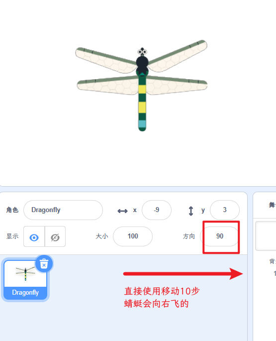
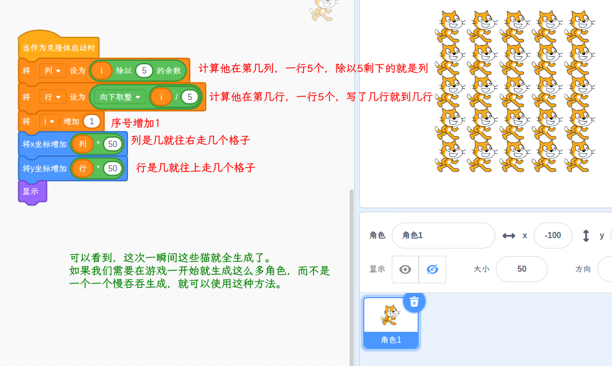

# Scratch 入门
---
## 一、Scratch界面简介

首先要从Scratch的原理说起。Scratch的基本原理是“**精灵挂脚本**”。精灵在中文版的翻译中是“**角色**”。
Scratch打开时默认的那只猫就是一个角色，一切程序都围绕着角色来进行。
在具体学习之前我们先看看界面的一些内容。

1. 角色**演出**的地方称为**舞台**
2. 角色身上拿着的**演出剧本**称为**脚本**
3. 角色还自带各种演出的衣服称为**造形**
4. 角色甚至还拿着一个音乐播放器，可以播放已有音乐，或者录音之后播放

**导演一般都站在舞台上**，所以舞台上也是可以放置脚本的，用来指挥角色活动。
角色身上也会自己携带**自己的脚本**，严格按照剧本内容执行。

这里要请初学者注意的是，随时关注你选中了哪个角色，**防止把脚本放到了错误的角色身上**。

###### 舞台区角色区和积木脚本区

## 二、角色基本操作

### 2.1 新建角色
角色区的猫脸用于添加角色，我们直接点击就会进入角色选择界面，然后从预置的角色库中选择你想要的角色。  

如果不点击他，仅仅将鼠标放在角色区的猫脸上，就会出现四个功能按键：

1. 上传一个`.sb3`格式角色文件或图片文件作为角色
2. 随机从角色库中选一个角色
3. 绘制一个空白角色
4. 用搜索角色

### 2.2 上传图片作为造型

作为高端玩家，我们果断选择新建空白角色： 

这时候我们就可以使用自己定制的角色来做后面的开发了。
需要注意的一点是，导入的图片最好是PNG格式，这样可以保存透明的背景色。如果上传了jpg图片，你将会看到一个人物带着一个背景方框在舞台上走来走去。
当然，你也可以直接使用上传角色功能，这个功能不光支持`.sb3`格式精灵文件，还支持图片格式。

### 2.3 透明背景

如果你是一名新手，如何区别背景色呢？只需要选中造型，在右侧的**绘图区**中观察图片的周围是否是**由方格组成的背景**即可，和photoshop等工具一样，方格代表了透明色。

我们要如此强调透明颜色的原因是，Scratch对于角色之间的碰撞的检测是要考虑透明色的。换句话说如果两个角色都是透明的，那么他们永远不会相撞，就像一只幽灵一样。只有不透明的部分会产生碰撞。

### 2.4 导出

另外角色身上的造型是可以被右键选中导出为图片的。如果我们发现了别人的造型十分喜欢，只要对方是**开源**的作品，我们就可以用右键保存到电脑使用它的造型。

更进一步的，我们还可以在**角色区中右键导出角色**，导出的角色可以方便我们使用在另外的脚本之中。这个功能在本书后会详细介绍。

### 2.5 剪辑和录音
在角色身上还可以携带不同的声音。我们也可以在右面的声音波形剪辑区，使用鼠标左键选中一段音乐，用backspace键删除它，用来截断我们不想要的音乐。当然下方还有功能更为强大的效果按钮供我们剪辑使用。

和造型一样，除了可以选择Scratch自带的声音库中的音乐，还也可以从计算机中上传一音乐，可以是mp3或者wav格式。
当然，也可以录制自己喜欢的声音来作为配音使用。

### 2.6 角色属性盘
在角色区的上方是角色属性盘，角色运动的时候这里的数据会发生变化。  
同时我们也可以**改变角色属性**达到控制角色变化，注意**除角色名以外不要用调整角色属性代替角色初始化的代码**，因为这里的数据是调试环境临时改变用的，不是生产环境使用的。

1. 角色名
2. 角色的坐标
3. 面向方向
4. 是否显示
5. 大小

## 三、角色位置和方向
### 3.1 角色坐标和中心点
角色的坐标的确定有些隐晦。相当于用一个钉子把一张剪影画（角色造型）钉在了舞台上，这个钉子钉下的位置就是角色的坐标。
那么如何观察这个钉子钉在了什么地方呢？

如果我们再在角色中心画一个十字架，不难观察到的是角色在舞台上面的坐标，就是角色中心的十字星的坐标，他也是和角色的中心一一对应的。

### 3.2 方向

在角色属性盘中，可以看到右上侧方向边上有一个方向控制器，用鼠标左键点击，就会弹出来蓝底白色箭头操纵杆，可以拖动旋转他达到直接更改角色面对方向的目的。

### 3.3 在播放时是否可以拖拽

首先要介绍Scratch的播放功能，在Scratch之中运行程序可以有两种模式

1. 编辑器模式
2. 播放器模式

点击右上角的全屏按钮，即可打开和结束播放器模式，如下图：

**编辑器模式**之中，如果想使用鼠标去点击角色，Scratch会默认角色**拖拽为第一优先级**。
换句话说，**本来想点一下舞台上的角色，结果却会把角色拖动起来**。这样的设置意义在于可以**方便我们在舞台上面使用鼠标拖拽排布角色**。

而全屏播放器模式之中，角色是**默认不可以被鼠标随便拖动**的。这样就避免了执行程序时候的各种错误。当然也可以把播放时可拖拽的开关打开，这样在播放时我们也可以随意拖拽角色实现一些功能。

## 三、积木介绍
`Scratch`是积木式的语言（`Blockly`），依靠积木的可连接性来组成代码，防止简单语法错误的发生。
默认的`Scratch`界面分为九种积木，两大类：
1. **形象部分**：运动、外观、声音
2. **抽象部分**：事件、控制、侦测、运算、变量、自制积木。

本章将分别介绍所有积木的使用方式和一些易错细节，最后会展开描述所有积木的潜在使用场景。
注意：本章建议在**看完全书之后再次阅读，或已经学习过Scratch一段时间的读者阅读**，你将获得对Scratch更加系统和深化的理解。

### 3.1 运动

Scratch的运动积木可以实现的功能归根结底只有两类：
1.  移动
2.  转向

其中移动类又分为了：
1.  直接移动和滑动
2.  增量移动
3.  移动到某角色或者鼠标指针
4.  向面向方向移动

转向类分为了：
1.  直接转向
2.  增量转向
3.  面向某角色或鼠标指针

**注意：**
1. 直接移动或者转向的模式相当于**直接指挥角色**。直接安排角色到达某个地方面向某个角度。
2. 增量的移动转向或者向面向方向移动，相当于**编写角色的内部逻辑**。例如设定某小车遇到红色左转30°遇到蓝色右转30°。

### 3.2 外观

外观控制包括了下面几种类型：
1.  角色身上造型切换
2.  外观特效
3.  角色大小设定
4.  说话思考
5.  层叠关系设定
6.  显示隐藏

#### 3.2.1 造型切换
其中造型切换可以传入变量控制，其中变量可以是两种形式：
1.  数字123456...对应了造型的编号
2.  字符串，例如：“造型1”，对应了造型的名称

Scratch都可以自动的识别并找到对应的造型。如果好事者非要把编号为2的造型名称写成1，想看看究竟**造型编号**和**造型名称**哪个优先级更高。
那么答案是**造型名称更高**，在“将造型切换为”积木中传入变量1时，名字为“1”的2号造型会显示出来。

#### 3.2.2 外观特效
角色外观的特效分为了好多种类：
- 颜色
- 鱼眼
- 旋转
- 像素化
- 马赛克
- 亮度
- 虚像

其中最有用的是`颜色`特效，他会在**HSB**的色轮上，把造型现有的所有颜色都增加固定的数值。
例如造型现在是**红色**，`增加颜色特效120`会把角色变成**蓝色**，造型身上如果还有**绿色**，则会被转换为**红色**。
我们如果**不想制造更多的造型**，而想制造一些**新鲜感**的话，可以对角色的颜色特效进行设定，比如用一个红色的角色做基础款造型，这样方便我们**知道增加颜色特效之后，造型大致会变成什么颜色**。
但是这里有个**警告**：对于不了解Scratch性能的初学者，请减少颜色特效的使用，这**几乎是最能拖慢Scratch运行速度的语句**。这相当于给正常走路的人背了一大桶水，又要走路又要负重。

第二有用的特效是`亮度`和`虚像`：
- `亮度`的正值可以增加`亮度`直到`100`会变成`纯白`，负数值直到`-100`会变成`纯黑`
- `虚像`特效从`0`到`100`分别对应了`实体`和`绝对看不到`。
  1.  虚像设为100时，角色完全不可见，但是仍旧**可以识别碰撞**
  2.  如果也不想角色识别碰撞，可以直接将角色**隐藏**

这两种用法会在不同场景派上用场其他的外观特效使用较少，请读者自行尝试功能，但是要注意的是在**使用过外观特效**之后一定要使用**清除全部特效**，否则很可能会因为设置了虚像而找不到角色。
#### 3.2.3 大小设定
Scratch的舞台大小是$480 \times 360$，导入计算机图片作为造型时可以传入不同大小的图片，如果大于Scratch的舞台，软件会自动帮我们把图片缩放到合适尺寸。但是这样可能会造成清晰图片的锯齿化。所以，请**合理选择图片的大小**。

角色身上的**第一个脚本**，我们要养成习惯**对角色的大小进行设定**。而增量大小设定积木可以配合循环模块来动态变化角色的外观。例如可以将角色做成心跳的闪动效果，下图就是心跳效果的实现和变种：

#### 3.2.4 说话思考
对于**高端玩家**来说，说话思考积木，大多数情况下应该只用在**调试**过程中。可以将变量或者积木块放入说话和思考框之中，让程序在运行过程之中显示中间结果，方便我们调试程序。
相当于文本语言中的`print`，请收好你们说的`hello world`的冲动。

#### 3.2.5 层叠关系设定
Scratch的层叠关系设定十分迷惑。
设想我们有多个角色，每一个人身上都有一段`当绿旗被点击`和`移到最前面`的积木脚本。点击绿旗之后会发生什么情况呢？
大多数人会说不知道，求是的说，Scratch会把你创建顺序在先的`当绿旗被点击`之下的脚本先执行。
这是由于这个`当绿旗被点击`积木在Scratch内部被首先注册出来，所以就会首先运行。这种多个脚本同时执行，说穿了只是**计算机运行速度很快的假象**。在Scratch内核，程序执行还是**有顺序的而并非真的并发**。

再来设想我们的多个角色身上`当绿旗被点击`的积木下有的跟着`移到最前面`积木，有的跟着`下移1层`，有的跟着`下移2层`....当我们点击绿旗让程序运行，会发生什么？
答案是，虽然我们知道了先拿出来的`当绿旗被点击`积木首先运行，但是由于层级关系太复杂，还是很混乱**无法预测**。这就是Scratch层叠关系设置欠合理的地方。

所以我们在使用层叠关系时候应该坚持一些**原则**：
1. 例如尽量不使用多于3层的层叠关系
2. 如果一定要使用多层次关系，那么在设定层级关系时请使用微小的等待时间差距来自己控制层级顺序
3. 对于一直要处在最上层或者最底层的角色，请使用重复执行移到最上层或下移10层的脚本控制角色
4. 更好的层级控制方法是在舞台上使用发送消息并等待积木，实现多角色之间的顺序设置层级，这是因为程序执行中有可能出现卡顿，上面3中通过时间设定不够准确

#### 3.2.6 显示和隐藏
在角色的属性盘之中，我们也可以设定角色**是否显示**，且Scratch的显示隐藏还有各类特效和画笔都是**记忆状态**，换句话说：
- 如果某次运行我们让角色隐藏了，那么下次再运行程序，角色还是被隐藏的。
- 这次画的画，如果没有在下次开始时清空就会存留下去。

所以我们如果要使用隐藏积木，请一定记住让**显示积木跟在`当绿旗被点击`积木后面**。成对使用积木的规律我们要遵守以下三条：
1.  隐藏和显示
2.  外观特效和清除特效
3.  画笔图章和清空

事实上更加广义的来说，这是一个将程序**初始化**的过程。任何的程序都需要妥善的初始化，你需要做两件事情：
1.  将所有的状态都清空或者设为初始值
2.  将所有定义的变量都赋予一个初始的数值
3.  把所有角色都置于你已知的控制范围内，这是防止程序逐渐庞大后出现奇怪问题的预防针。

### 3.3 声音
这里指的是角色携带的音轨播放：

我们可以把角色携带的声音用积木块播放出来，这主要作用是播放音效，例如吃到金币的**音效**，被打击的音效等等，我们还可以选择：
1. `播放声音`：打开声音就让脚本继续向下执行
2. `播放声音并等待`：打开声音不放完就不往下执行脚本

一般**触发音效的情况**下要使用第一种，这样让角色播放音效的时候相当于打开了音乐就继续去做别的事情，不耽误后面的程序运行。但是要注意的是，如果要播放游戏结束音效，我们打开声音后面跟着一个`停止全部`积木，那么声音就听不到了，因为播放声音了之后马上结束了所有脚本的运行。
但是我们又不想播放声音并等待，因为那样会造成角色阵亡了还可以乱动，直到结束音乐播放完毕才可以停下来脚本。这种问题我们有两种解决方案可以参考：
1. 使用`播放声音`+`消息`+`停止角色身上其他脚本`积木，消息通知舞台上所有其他人停止。
2. 使用`播放声音并等待`+`消息`+`结束全部`，通知本角色身上关于运动的脚本停止。

但如果是要播放背景音乐，那一定要使用`重复执行`+`播放声音并等待`，必须播放完了一遍再播放下一遍。

### 3.4 音乐
在扩展积木中有个音乐分类，这里有Scratch合成音符播放： 

Scratch的播放音符可以实现打击乐器和乐音乐器两种效果，通过数字编号**0到200对应了十二平均律**的各种音高。这样我们就可以用变量来控制音符的播放了，这样可以播放我们自己的乐谱。
然而Scratch的音符是通过正弦波频率来合成的，低于**40编号的音符听上去很奇怪**，而且无法实现连续音符的过渡，所有的音符都是单独的，**并不能实现什么优美的音乐效果**。所以如果想播放音乐，还是**使用外部导入音乐**来的方便。

### 3.5 画笔
Scratch的画笔是角色坐标和外观的延伸，也是在扩展模块里面，默认没有加载进来。

1. `落笔`和`抬笔`指的是在角色中心，也即是角色坐标位置落笔Scratch积木和应用原则
2. `图章`指的是将角色现在的造型印在背景上
3. `画笔`和`图章`都直接画在了`舞台背景`之上，如果有其他角色，将会**覆盖画笔**的内容，因为**舞台**在Scratch之中是默认**最底层**的，不可能有比舞台还底层的东西。
4. 画笔图章和角色隐藏与否无关，**隐藏的角色依旧可以画笔和使用图章**。
5. 画笔和图章之间是可以互相覆盖的，**后画的覆盖先画的**。

对于画笔来说，Scratch 3.0之中可以完整的设置色相、饱和度和明度，也即是HSB颜色空间。
在Scratch 2.0中我们只能设置画笔颜色为0到200为红橙黄绿青蓝紫的色相，饱和度是固定的。
作为代替，我们可以使用取色器设定画笔颜色积木块来设置其他颜色。不过麻烦在于我们没有办法取Scratch软件外的颜色，除非我们**把色卡做成一个角色造型**，导入到Scratch之中，然后**使用取色器取用颜色**。
其实Scratch留有一个RGB的后门的，`取色器`设定画笔颜色积木块可以放入一个变量。我们可以用这样的方式来控制RGB和透明度Alpha:

应用上，画笔大多是和运动控制结合使用的，然而我们总是局限于运动物体速度过慢的情况，这种情况下我们要使用`自制积木`的`运行时不刷新屏幕模式`来实现快速画笔，该模式将在自定义模块部分详细介绍。

### 3.6 事件
Scratch之中圆顶的积木称之为**脚本入口**，也即是当他们等待的条件满足时，就开始下面连接的脚本。Scratch有六大脚本入口：
1.  绿旗入口
2.  切换背景入口
3.  角色点击入口
4.  按键入口
5.  声控入口
6.  消息入口

事件里面除了接受信号的，还有发送消息的：

其中前五个入口是可以由人为发起的，最后一个是角色之间互发消息发起的。这里面最常见的绿旗入口我们几乎每天都要用到，但是我们真的了解绿旗入口么？
#### 3.6.1 绿旗
我们究竟需要几个绿旗入口？前面在讲解层叠关系时说到了绿旗入口的Scratch内核注册顺序问题。
虽然说计算机内部都是**顺序执行**的，但是我们还是在编写**并发程序**，也即是说许多绿旗入口在你一次点击之下会集体开始执行。在这种可怕的无法预测的情况下，我们需要做到的是**防止两个绿旗入口下的脚本互相干扰**，例如：
- 一段代码把一个变量改变了一个数值，另一段代码又改回去
- 一段说要停止程序，另一段却又开始等等。

合理的拆分程序到不同的绿旗入口之下是一种必要的程序逻辑训练，如果有条件和耐心，不断地重新编写一个程序，以求更加的清晰和优化，这会极大地有助于编程思维能力的提升。
笔者的计算机课程老师经常教育笔者：**如果发现程序错了，全部重新写一次，那将比你试图修改要快的多，而且你将有机会重新审视自己这段程序的逻辑，是最好的训练之一。**
我们要坚持的原则是：
1.  把互相**无关**的东西放在**不同**的绿旗入口之下。
2.  检查程序流向是否会**互相交叉干扰**，同一个消息只有一个发送者，同一个变量同时只有一个更改者。

好事者又要提问了，如果同时一定有好多角色可以操作到某个变量，应该怎么办？
答案是，应该**加锁**，这个过程将在后续章节之中介绍。

#### 3.6.2 切换背景入口
切换背景入口是为了**不同关卡的场景**切换而生，进入规定关卡则执行该入口下的内容。建议在设计复杂的多关卡游戏时，**只在总控制部分**放置切换背景更改状态的脚本。
如果每个角色身上都带有此类脚本，而背景又经常切换的时候，逻辑将变得及其复杂，调试起来十分痛苦。
#### 3.6.3 角色点击入口
角色的点击入口又要牵涉前文提到过的**拖拽角色优先级最高**。我们可以尝试简单的放下，当角色被点击则角色大小增加10。
- 在编辑器状态下点击角色，角色将被拖拽起来而不会执行增加大小的积木。
- 在播放器状态下，点击角色可以看到角色增加了大小。

而且更重要的一点是，这个入口是一次性激发的，也即是我们如果在播放器状态下对角色点着鼠标不放，角色大小只会增加一次。
要想执行第二次**必须松开鼠标按键再次点击**。这种防止被多次触发的机制也让该入口成为Scratch最安全的入口之一，当然前提是在播放器状态下。
#### 3.6.4 按键入口
刚才我们讨论了角色被点击入口，大家可能还不能理解入口被多次触发带来的困扰，现在麻烦就要来了。
假设我们要写一段脚本，当向上键被按下时，角色的y坐标增加10。使用如下代码，当我们长按向上键时，可以观察到角色首先向上移动了一下，接着开始快速向上移动，中间发生了一个小的卡顿，好像向上窜了一下才往前移动，控制起来十分不流畅。

为什么会发生这种奇怪的现象？
这是因为Scratch对于**积木块执行速度的有特殊的控制**。Scratch既想让按键可以单独的控制某个动作，不至于因为单独按键发生了连续执行的效果，又想让按键可以产生连续的控制这个动作。
这种矛盾的做法**让按键入口很难作为角色移动的控制**。一般来说我们要使用重复执行和侦测判断按键来实现稳定的角色移动控制。代码如下：

为什么重复执行价侦测判断的方案就可以稳定的控制角色移动呢？这要从**游戏引擎**说起了，任何一款用作游戏开发的引擎必然会自带一个**执行速度固定**的语句。
我们要实现角色以一个固定速度移动，我们只需要让他**固定时间长度往前移动固定步数**即可。设想这个语句的执行时间不固定，角色的速度也会不固定，这样就没法实现最简单的匀速运动。
熟悉游戏开发的朋友可能知道，在Unity编辑器之中有一个FixUpdate()语句，可是实现固定时间长度的运行。高级的物理引擎也都是基于这个语句实现的。
在Scratch之中，为了不把这个问题展示给初学者引起不必要的迷惑，开发者们聪明的将重复执行积木变成了这个固定时间长度语句。
也就是循环中间装入不是很多语句的时候，每次循环中间的语句执行完毕的时候还会等一小下，把一次循环的总时长补到大约是`0.03s`左右（测量并不准确，大概1s循环30次）。

因此，我们把“重复执行”积木之中放入一个“移动10步”积木，就可以实现角色的移动。究其根本是因为**重复执行锁定了每一次执行的时间**。
好事者又想问，如果我们往重复执行里面放入许多`耗时极长`的语句，会不会挤爆重复执行语句？
答案是**不会**，一旦重复执行之中包含的语句超过了重复执行锁定的时长，重复执行的时间就被**撑长**了，撑到执行完中间包含的所有语句，也就是说执行时长超过`0.03s`。

#### 3.6.5 声控入口
Scratch可以调用麦克风识别响度数值，如果响度大于某数值则该入口开启。
声控入口和角色点击入口一样是一个**单次入口**，也即是**开启之后必须等响度小于这个数值之后才能第二次开启**。不会产生多次开启的情况，也是一个比较安全的入口。
#### 3.6.6 消息入口
消息入口也称为消息接收器，是六个入口之中唯一一个不能靠人为开启，只能靠程序控制的入口。
角色的消息既**可以发给别的角色，也可以发给自己**，还可以发给舞台上的脚本。这部分内容在后续内容将会详尽介绍。

### 3.7 侦测
Scratch的侦测积木分为以下几类：
1.  距离和坐标侦测类
2.  角色信息侦测类
3.  视频侦测类
4.  响度侦测类
5.  询问回答和计时器
6.  碰撞侦测类
7.  按键侦测类 

侦测积木主要会产生两类结果：
- 一类是数字，例如：坐标值、距离值、视频变动剧烈程度、响度、计时。
- 另一类是布尔值，也就是真或者假，例如：是否按下了鼠标按键、是否按下了某键盘按键、是否碰撞某角色某颜色等。

#### 3.7.1 距离和坐标侦测类

该类积木主要作用是获得和某角色或者鼠标指针的距离以及获得鼠标指针的位置：
- 可以方便的实现一些例如防御力场之类的效果，例如距离某角色50步就无法继续前进。
- 也可以获得和鼠标之间的距离用来实现鼠标操纵。

#### 3.7.2 角色信息侦测类

该积木可以实现在**某角色**身上的脚本中获知**其他角色**状态的功能。例如某boss想根据玩家角色的坐标值做出一些反应，就要依靠这块积木获得玩家角色的坐标值。
如果不想使用这块积木，我们仍旧有替代方案。那就是把**玩家角色的坐标值赋值给一个全局变量**，然后所有人都可以看到这个变量。但是，这难道不是多此一举么？为什么要绕一个弯做这样的事情？
其实这种做法是有使用场景限制的，如果**某个数值有许多人都要读取**，那么最好把它做成一个全局变量。这样当我们要改写程序的时候，只需要改变这个全局变量就好，只需要**动这一个地方**。
假如我们在每一个用到这个数值的地方都用**侦测角色信息**的积木这样使用，那么我们如果要改动就要改动好多地方，这时候疏漏和麻烦就找上门了。
不要一味地使用角色信息侦测积木，合理的使用变量可以方便我们做出易于更改维护的程序。

#### 3.7.3 视频侦测类
视频侦测类默认没有加载，需要我们添加进来。  

这是一个帮助文档也稀里糊涂解释的东西，它包含两个类型的内容：
1.  视频运动(motion)对于角色
2.  视频方向(direction)对于角色

##### 3.7.3.1 视频运动
**视频运动**其实是角色对应视频区域之中，画面活动频繁程度的一个数值。角色对应区域画面如果没有任何移动，那么该数值将会很低，甚至为零。

如果该区域画面之中活动剧烈，这个数值将会激增。Scratch官方以此为根据做了一个切水果的游戏，就是检测落下水果对应视频区域画面活动剧烈程度，判断是否被人手在视频中切中。
好事者又来提问了，假如我们**让一个苹果从舞台上方逐渐掉落**，那么苹果背后的视频和苹果发生相对运动，在苹果的眼中视频运动应该很高才对，是这样的么？
答案是不会的，我们可以简单地实现一下这个场景，就会发现这个数值根本就在0左右**没有动**。
原因是Scratch的运行和拍电影一样是一帧一帧执行的，只是速度很快的时候我们肉眼无法分辨觉得它在运动。**每一次视频运动检测都在角色移动了微小一步之后发生，这时角色已经停下，下次微小移动还没发生**，当然不会和视频有相对运动。

##### 3.7.3.2 视频方向
**视频方向**这个概念就更加迷惑了，这个数值好像一直就在狂跳从没稳定过。其实这个视频方向指的是角色对应视频区域里面视频运动方向。如果不理解的话，我们来做个试验。
1. 首先画一个占据舞台的大圆球作为角色1，如果没有完全占据则调整外观角色大小。首先将圆球设置外观特效为虚像80，打开摄像头，然后把视频方向对于角色1的赋值给变量
dir。
2. 画一个指向默认方向90°的方框，中心设置见上图。让该方框的方向重复执行始终指向
dir。
3. 运行观察，在大圆盘内挥手观察角色2指向的方向就会发现这个指针在那蹦迪：

我们可以见到，手臂在视频中朝向哪里挥动，角色2就像指针一样指向了哪里。但是值得注意的一点是，这个方向**十分不稳定**，跳动还是有些剧烈，不适宜直接使用。本书将在后续章节**滤波器**之中讲述如何让该数值稳定下来以便使用。
此外关于视频处理要补充的一点是：无论我们将视频透明度设置成多少，哪怕设置成100完全看不到视频图像，动作和方向检测依然不受影响的生效。
#### 3.7.4 响度侦测类

相对检测相对于视频检测就容易理解的多，无非是麦克风输入的声音大小会变成一个响度数值。在之前的响度入口之中也可以直接使用。在此不做详述。

#### 3.7.4 询问回答和计时器

熟悉文本语言的读者应该一眼就瞧出来询问回答就是C语言中的`scanf`，为了输入变量而生。一般的用法是：
1.  向询问框之中放入字符串变量，例如列表中存储许多问题，抽出一条放入询问框
2.  询问之后程序会等待用户作答，按Enter键之后，这个答案就被存储进了`回答`变量之中
3.  将回答变量用在别的地方，例如判断是否答案正确

计时器变量大家十分熟悉，但是却并不一定知道如何把他玩出花活。这里就举两个例子帮助大家打开思路，例子实现在后续章节介绍
1.  使用计时器和自定义的变量配合实现蓄力攻击的效果
2.  使用计时器实现连击效果，要知道连击的触发只在一段时间内有效

另一件值得注意的事情是，Scratch的计时器和等待1秒积木，归根结底和其他语言之中的
wait(),delay()差不多，**并不是真实世界的时间**。其实Scratch是留了最精确的时间取值点的，那就是一个不起眼的“自两千年至今的时间”积木。
1.  `等待1秒`积木的运行和Scratch的软件运行有关，软件卡顿则计时卡顿，所以**最不准确**。
2.  `计时器`积木的运行和CPU的运行有关，计算机卡顿则计时卡顿，所以**第二不准确**。
3.  `自两千年至今的天数`所获得时间是获取网络时间，要秒数只需要给他乘以24小时再乘以3600秒，**最为精确**。

#### 3.7.5 碰撞侦测类

这类积木可以说是最常用到的积木了，角色之间发生交互，被子弹击中等都要靠它们来实现。是否碰到某角色和鼠标大家凭直觉都会使用，就不在此赘述。这里要主要说的是碰到颜色的应用场景。Scratch提供了两类颜色碰撞侦测：
- 角色碰到某颜色
- 角色的某颜色碰到某颜色

这里依靠取色器规定颜色，当然也可以用我们之前介绍画笔取色器时说到的RGB后门来规定颜色。颜色碰撞有两类用法：
1. 区分碰到一个物体上的不同部分。我们称之为**一化为多**
2. 用许多角色共有的一种颜色碰撞检测语句，来代替多条碰撞角色检测语句，我们称之为**多归为一**

`一化为多`的举例：由于Scratch没有自带物理引擎，许多角色间碰撞和反弹实现起来总是比较尴尬，补充方法就是依靠颜色检测来实现。假如我们想知道是**撞到了一个角色的侧面还是撞到了顶面**。这时候就只能画上一些可以区别的颜色，通过颜色就可以判断是撞到了哪个部分。
`多归为一`的举例：假如舞台上有**好几种敌人**，玩家角色碰到敌人会阵亡。那么最好在设计的时候就把所有的敌人**都标记上共同的一个颜色**，只要在玩家角色上检测是否碰到该颜色，就知道是否碰到了敌人。否则我们就要写出碰撞所有敌人的语句十分麻烦。
此外，角色的某颜色碰到某颜色，适用于判断角色的某个部分是否碰到另外角色的某部分。

#### 3.7.6 按键侦测类
该类积木的使用场景均在键盘和鼠标控制之中，后续章节会主要介绍。

### 3.8 运算
Scratch的运算分为三类
1. 数字运算
2. 字符串运算
3. 布尔值运算

#### 3.8.1 数字运算

Scratch的数字运算**没有括号**，每一个积木就相当于一个括号，所以请大家关注一下运算的**优先级关系**。尤其是多层嵌套之后往往会看花眼。这时候的解决办法就是，**多设置几个中间变量打散计算步骤**，这样也可以检查计算中的数值出现的问题。
除了四则运算之外，Scratch提供了两个方便的运算积木，`求余`和`四舍五入`。在文本语言之中，求余可以方便我们获得数字的某一位或者某几位。
然而在Scratch之中，`数字`和`字符串`是界限不明显的。我们可以把`数字`当成`字符串`，接着使用`字符串运算`的提取某一位字符来实现获得数字的某一位。
Scratch还给我们提供了包括乘方开方、上下取整、反三角函数和指数对数在内的一个较为强大的`科学计算积木`，在后续的数学章节之中我们会着重介绍这些工具。

#### 3.8.2 字符串运算

Scratch之中的字符串工具可以使用在许多地方，包括使用字符串链接工具和变量组合来实现对于角色外观声音背景等的切换。读者可以自行尝试，所有可以从本地上传的例如音乐图片等均可以通过字符串变量来控制切换。
例如我们向一个角色上传了十段音乐，命名分别为：音乐1、音乐2、音乐3......我们可以使用如下的积木来实现批量播放音乐。

#### 3.8.3 布尔值运算

首先要说的是什么是`布尔值`，为什么要有`布尔值`。
布尔值只有两个，一个是`True`另一个是`False`。布尔值的产生是为了**让计算机学会应对真实世界情况**。小到游戏之中一个角色被子弹击中会扣血，大到火箭发射按钮，全部都是由布尔值操纵的。
设想一种情况，我们想让计算机在周围声音很大时作出一些反应，那么步骤应该是：
1. 真实世界被**传感器**处理，例如我们可以获得一个响度数值，这个响度数值有时大有时小。
2. 我们要设定一个值50，然后写一个`布尔单元`：如果大于50就为`True`，如果小于等于50就为`False`。
3. 计算机就会在现实世界声音很大后作出一些反应。

但是现实世界往往更为复杂，让计算机作出判断的条件也更多，甚至条件之间要互相影响。
比如我们想让计算机在中午12点之后对于周围声音很大作出反应，那么步骤将被改写为：
1. 真实世界被**传感器**处理，例如我们可以获得一个响度数值，这个响度数值有时大有时小。
2. 另外有一个时钟**传感器**，可以获得时间。
3. 设定`声音大于50`布尔单元，设定`过了12点`布尔单元
4. 进行布尔运算得到：`声音大于50`并且`过了12点`
5. 计算机将会对过了12点之后的声音很大作出反应

这样我们处理问题的完整流程应该是：
1. 真实世界
2. 传感器获得数值
3. 设置布尔单元处理单个传感器
4. 对于多个布尔单元进行布尔运算得到一个结果
5. 让计算机对于计算结果布尔值进行反应 

### 3.9 变量

Scratch自带两种数据结构，变量和列表。一共有以下几类积木：
1.  变量赋值、变量增值
2.  列表增删改查，列表长度信息 

#### 3.9.1 变量
变量在创建时会被询问作用域，也即是询问是对舞台上所有角色有效，还是只对当前角色有效。
- 对所有角色有效的变量我们称之为**全局变量**；
- 只对于角色自己有效的变量我们称之为**私有变量**或者称之为**局部变量**。

不同角色的私有变量可以重名，这就省去了我们命名的麻烦。
如果**想给每一个克隆出来的角色加上一个血量值**，那么我们必须用到`私有变量`。如果不小心设置了全局变量，那么一个角色死亡时，所有的克隆角色都将死亡，这显然是不合理的。
不管怎样，我们要**尽量的使用私有变量，可以私有的变量都设为私有**，这样在复制或者导入导出角色时，会减少许多因为全局变量带来的麻烦。
#### 3.9.2 列表
Scratch的列表的操作十分简单，无非是`增删改查`四类，再加上一个判断列表长度。
列表创建之后，会在舞台上显示，这时在舞台上右键列表可以导入导出数据。列表支持txt格式，以换行符区别列表不同的项目。换句话说，我们创建一个txt，在里面写入数据，回车换行就可以把数据导入到Scratch的列表之中。
这种导入有什么用武之地呢？这里列举几个场景供大家参考：
1. 用别的语言写好的**曲线坐标方程**，可以通过x、y两个列表导入Scratch绘制**复杂图形**
2. **乐谱**可以通过列表导入实现Scratch音乐播放
3. **语言问答库**可以通过列表导入之后制作问答机器人

### 3.10 控制

Scratch的控制积木分为四类:
1. 循环类
2. 条件分支类
3. 等待停止类
4. 克隆相关类

#### 3.10.1 循环

Scratch提供了三种循环积木，分别是：
1. 无限重复积木
2. 计数循环积木
3. 条件跳出循环积木

**无限循环**
- 也称之为“死循环”，应用极其广泛。任何一个系统在启动的时候都进入了一个死循环，无条件的重复一些语句，例如监听某个按键是否按下，判断是否碰撞某个角色，一直重复某种运动等等。在前面按键入口的地方曾经叙述过Scratch死循环的运行最短时间固定特性，在此不重复讲述。
- 要注意的原则是：**尽量少让消息入口下面使用死循环**，可能会产生一些令人迷惑的结果。

**计数循环**
- 可以循环规定次数，然后继续后面的积木运行。这个积木值得注意的是，我们是否可以动态的更改循环次数？例如我们用一个变量i来规定循环次数，在该循环之中不停地改变`i`的数值，那么循环的次数会根据i来改变么？
- 答案是**不会**，Scratch的计数循环**只会记住第一次传入的`i`的数值**，并严格执行这么多次循环然后跳出循环。这是为了防止儿童在编程时动态的改变循环次数产生错误。Scratch里面不可以在程序之中新建变量和列表，原因也是如此，这样可以防止儿童在使用时产生程序崩溃。

**条件跳出循环**
- 每次执行前都会判断条件是否成立，如果条件不成立就不进入这一次循环。这个积木很好的补充了Scratch没有break语句的缺陷。

#### 3.10.2 条件分支

条件分支积木十分简单，只有`if`和`if else`两块，不做赘述。
#### 3.10.3 等待和停止类
**等待？秒**

- `等待？秒`是Scratch最常用的控制运行节奏的语句，经常和重复执行动作配合使用。但是要注意的是，因为循环执行最短时间固定的特性，`等待？秒`如果设置的**时间过于小**，将变得**毫无意义**。因为Scratch还是会**自动补全时间到循环的固定最短时长**。
- **需要注意的是**：`等待？秒`积木也会自动补全时间差，该积木有一个最短运行时间大约是`0.033s`，和循环最短时间一致，具体应用细节请参考后续章节scratch疑难问题举例。

**在条件到达之前一直等待**

- 这个积木十分有用，可以方便的帮助我们消除某些二值条件的重复影响。
- 例如，当我们按下空格的时候要执行一个动作，不论我们是用按键入口方法实现，还是用重复执行+条件判断按键是否按下来实现。当我们长按空格的时候，动作会被病态的重复好多次。这时候我们就要依靠等待`空格键按下不成立`的来实现**长按屏蔽**。只有当空格键抬起，这条等待语句才可以继续向下执行循环。

**停止积木**

- 停止积木有三种：
  1. 停止全部，等同于绿旗边上的红灯，结束全部舞台上的程序
  2. 停止当前脚本，停止本段脚本
  3. 停止角色其他脚本，停止角色身上除了本段脚本之外的所有脚本

- **需要注意的是**：
  - 停止全部有时候**并不能**真的停下我们全部的程序，原因可能是程序有绿旗入口之外的别的入口。
  - 虽然程序被停止了，但是**入口又被按键声音等激发打开**。
  - 妥善的停止程序运行是一个很细致的工作，有时候游戏角色阵亡，但是还有一系列特效和动作没有播放，这时候不能贸然停止全部。要用消息等待等方式确保所有舞台其他角色都停止运行，然后再停止全部。

### 3.11 克隆相关类

Scratch和一系列游戏编辑器一样，都需要克隆功能，来制造**批量**的敌人、子弹、背景等角色。克隆积木分为：
1.  克隆动作
2.  克隆体入口
3.  删除克隆体

`克隆动作`可以由本角色发出，克隆自己。也可以由别的角色发出克隆某角色。推荐的方法是，**使用舞台作为克隆的总控制器**，防止脚本理解和管理混乱。
`克隆体入口`是决定`克隆体`和`母体`区别的关键，`母体`并不会运行该入口下的脚本，只有成为了克隆体才会执行该入口以下的脚本。通常的做法是：
1. 将母体大小和造型等设置完毕后隐藏。
2. 在克隆体启动入口下将克隆角色移动到规定位置后显示。

克隆之中的细节问题将在后续的克隆专题之中详尽描述。

### 3.12 自制积木

Scratch的`自制积木`之中涉及函数制作，和文本语言的函数功能类似，只是没有返回值的存在。
其意义在于打包某功能之后重复使用。可以设置参数，这里包括了`数字参数`、`字符串参数`、`布尔参数`三类，分别对应Scratch的三种变量类型。
好事者又来提问，如果我们定义两个自定义积木，分别定义他们的参数。他们都包含一个叫做`num`的参数，那么这个从定义条上拖出来的参数可以互换着使用么？
答案是，可以的。Blockly的底层还是文本语言，**重名的不同`函数参数`可以互相放置**，不会产生问题。
自定义积木最关键的使用方法是`运行时不刷新屏幕`，一旦勾选了这个选项，入口下的所有循环**都被取消了固定的最小运行时间**，运行速度大约会提升1000倍，所有程序跑的飞一样快。
但是一旦不小心往这里面放置了很多语句，电脑就会被卡住，这也是风险所在。
还需要注意的是Scratch自带的加速模式（编辑菜单下）并不建议使用，因为**很可能会让计算机死机**。

## 四、Scratch疑难问题举例

由于Scratch是一款面向少儿的编辑器，为了避免儿童的随意使用造成软件崩溃，引入了许多不够完善的特性。刚接触时往往会陷入一些奇怪的疑难问题之中。本章将会从以下几个方面介绍日常使用Scratch会碰到的边角问题：
1. 绘图和外观的坑
2. 看不见摸不着的事件控制
3. 不知道该用什么变量的克隆体
4. Scratch的谜之容错
5. 拖慢脚本的罪魁祸首

### 4.1 绘图和外观的坑
#### 4.1.1 任何图片都不能离开舞台
为了防止不小心把角色移动出舞台**找不到**，scratch做了几个限制。首先任何角色在移动到舞台边缘的时候会强制**留下一个边缘(大约15像素)**，刚好可以用鼠标拖拽它回到舞台之中。
例如我们使用坐标移动积木让某角色移动到`(100,0)`。这样角色实际上的x坐标在250多就已经卡住了，刚好在舞台上漏了一个角。
对于角色的限制不光在于位置，还包括了角色的**外观大小(不能超出屏幕)**。我们让角色大小设定为极大例如1000，在外观积木盒子最下方的大小变量之上用鼠标勾选之后，可以观察到，角色根本没有变成1000，而是卡在了几百就不在增加。
相应的，如果我们给角色设定一个1的大小甚至-1000的大小，角色大小就被锁定成了5。这是为了**防止角色太小无法画在舞台上**。
理解了scratch的这个角色不能离开舞台的机制之后，我们就可以考虑一些问题。如果想让一个克隆体从画面外移动进画面，这个动作可以做到么？答案是不能。
因为角色一旦设置一个画面外的位置，scratch就会强制把角色的一个小角拉到舞台上，这样画面边界一定会留一点角色，**根本无法让角色完全从舞台外移入舞台**。

如果我们一定要让角色从舞台外移动进舞台，就要把入口这个边界**用一个不透明的角色**遮盖住。这样在视觉效果中，就看不到这里的异常了。
例如我们想用scratch做一个横版卷轴游戏，类似超级马里奥。地图的卷动就需要从舞台外移动进来，这时候就需要把边界遮住防止玩家看到这里堆了奇怪的东西。
#### 4.1.2 矢量图和位图切边
首先要界定什么是`矢量图`什么是`标量图（位图）`，我们做如下界定：
1.  矢量图是指软件自己知道如何可以画出来的图，可以一条线一条线的画出来
2.  标量图是软件只拿到了一副画，这幅画被毁掉了软件也不会补充回来了

关于矢量和标量的定义和意义大家如果有兴趣请参看后文的数学概念。scratch对于外形自带了两种编辑模式可以互相切换，不过**非常不建议各位读者使用这些编辑功能**，因为十分不完善的编辑功能影响体验。这里要强调的是几个原则：
1. 从本地导入的图片，即时原来是所谓的“矢量图”格式，例如png等。导入scratch之后也默认变成了一个位图，因为它并不是scratch自己画的。
2. scratch承认的矢量图，只有两类。一类是造型之中切换矢量图编辑模式自己绘制的图片，另一类是scratch角色库之中自带的角色。
3. scratch承认的矢量图在造型之中编辑。如果不小心被我们在编辑中移动出画布，还可以移动回来。

但是本地导入的图片如果不小心移动出编辑画面就会发生切割丢失现象。

挪出去的猫猫变成了：

为什么会发生切割丢失现象呢？原因是图片移出了编辑区之后都会发生切割，但是**矢量图scratch知道怎么画回来，而位图scratch不知道怎么画于是就丢失了**。如何避免这个情况发生呢？只有一个办法：**编辑时候不要把图片放到屏幕外面。**
#### 4.1.3 角色和克隆体的复杂层级关系
在scratch之中有一种复杂的层级关系和管理原则：
1. 角色在舞台上被拖拽就会默认移到顶层。
2. 舞台无论如何都在最下层，画笔和图章都会绘制在舞台上。换句话说任何不透明角色都可以挡住画笔和图章。
3. 任何新创建的角色都会默认移到顶层。
4. 角色的克隆体默认在角色下一层。
5. 角色再次克隆的克隆体再角色和前一个克隆体之间。因为首先它是新生成的物体放在最顶层，其次执行角色本体在克隆体之上的操作。

这个层级关系很迷吧，是不是跟我们想象中不一样？所以在处理层级关系的时候我们一定要小心。   
#### 4.1.4 默认角度90°
scratch之中角色的默认角度是90°，我们在导入图片制作角色时一定要注意尽量让俯视图片的头部方向朝右。
例如我们要做一个火箭，火箭的头部如果朝上，后果就是我们用移动积木和方向积木来控制火箭时，火箭永远都是横着飞，这是我们尽量要避免的。 
但是如果是横版角色，例如scratch初始化的那只猫，就不存在这个问题了，因为它只有左右两个方向。
#### 4.1.5 消失的几种姿势
scratch之中可以通过三种方式让一个角色从我们眼前消失：
1. **隐藏**：最常用的方法，但是要注意隐藏是一个下次运行仍旧会保存的状态，要和显示积木配合使用。隐藏了之后无法判断碰撞其他角色，但是请注意，这时候**仍旧可以在隐藏角色身上判断碰撞边缘和鼠标指针**，这是scratch的特殊细节。
1. **透明度特效**：在外观特效里面可以用`透明度特效`让角色消失，这时候我们仍旧可以让角色判断和别的角色的碰撞，因为他还在舞台上。这样做的副作用是带来**运行速度的减慢**，如果有大规模的克隆体请尽量避免使用这种方法防止运行卡顿。
1. **选取角色图片和背景颜色相同，角色自然就隐藏起来了**：有些区域我们想看到角色就把该区域的背景换成不同颜色即可。这种方法十分巧妙，并不增加scratch的运行负担而且仍旧可以正常判断碰撞。

### 4.2 看不见摸不着的事件控制
#### 4.2.1 鼠标点绿旗的迷惑
在scratch之中，绿旗是我们最常使用的入口，但是如果我们让角色在鼠标按下的时候做出一些动作（例如发射子弹），这时候问题就来了。
一旦我们点击绿旗开始还没准备好真正开枪，scratch会马上发射一个子弹。这是因为scratch在**绿旗入口的瞬间抓到了鼠标按下的事件**。为了解决这个怪异的行为，我们必须使用一个称之为`锁`的东西。 
scratch给我们提供了很方便的实现锁的工具，那就是`等到直到`积木。我们只需要在绿旗入口下跟一句：`等到直到鼠标键按下不成立`。

这样在我们点击绿旗之后，程序会等待直到我们把鼠标键松开，才继续向下运行。就好像一个锁把程序运行的脚步锁住。这个概念我们将会在后文经常用到。 在真正的文本语言之中，锁的实现是用变量记录状态做的。这种方法略显复杂。在scratch之中经常使用的就是等待直到积木。
#### 4.2.2 消息等待
在scratch之中，我们经常会接触到消息发送接受。最常见的错误就是在消息等待过程之中使用死循环。
`广播消息并等待`积木将会等待所有的消息接收者执行完毕，如果有一个接受者身上带有一个死循环重复执行。
那么它将永远无法执行完毕，广播消息并等待的积木也将天长地久的等下去无法继续运行后面的内容。
#### 4.2.3 等待0秒？等待-1秒？最小等待时间是多少？
在scratch之中我们最容易搞不清楚的就是等待1秒积木。
其实等待积木和任何重复执行积木都在一次运行或者一次循环之后会将运行时间补充到0.33秒。
如果我们将等待积木写等待0秒或者等待-1秒，再测量其运行时间，结果都将是0.33秒左右。

#### 4.2.4 藏起来就不刷新屏幕的列表和变量 没有anyone刷新屏幕就飞快
是不是scratch的所有重复执行都会补充时间到0.33秒呢？这里是有例外的。 
如果我们把重复执行之中只放一个操作列表的语句，例如加入一个元素。

然后我们：
1. 先不增加刷新屏幕的代码，点击绿旗我们打开列表显示观察会发现一瞬间就执行完了，第一条时间和最后一条只差了零点几秒，这是因为重复执行积木中**没有任何要刷新屏幕**的积木，所以默认全速运行，也不会补充时间。 

1. 如果我们加入了刷新屏幕的代码，这时候再运行，发现列表元素增加的过程慢了许多。这是因为如果循环中有**刷新屏幕**的动作，重复执行积木会**补充时间**。

#### 4.2.5 死循环嵌套的后果
新手经常犯的错误还包括死循环嵌套死循环。外层的死循环运行第一次的时候就进入了内层的死循环，从此陷入了内层的死循环再也无法出来。也就是说，外层循环变成了一个摆设，因为就运行了一次根本不会循环。请大家一定要注意。

#### 4.2.6 计数循环变计数能否进行
假如我们用一个变量来控制计数循环，如果这个变量在循环之中被改变了，那么循环次数会动态的改变么？答案是，不会。
计数循环在**第一次运行时就已经被锁定了运行次数**，无论我们怎么改这个变量，循环次数是不会发生改变的。这是为了防止出现一些运行错误。

#### 4.2.7 拖拽优先级最高
在scratch的**编辑模式**（就是平常的模式，相对于全屏播放模式来说的），运行程序时，拖拽的优先级是高于点击判断的。
如果我们程序中设定了点击角色之后有一些操作，那么点击角色之后会**先把角色拖拽起来**，而不是执行这些操作。 
假如我们要做一个画笔，点击鼠标之后落笔开始画。点击画笔之后**先会拖拽起来画笔图案，而不是首先落笔**。 解决这样的问题有两个办法：
1. 第一个是永远**在播放模式下运行**，且不去勾选播放模式可以拖动的选项，这样就不会出现拖动的情况。
2. 第二种是将**画笔图案的中心设置在图案外**，这样在点击和移动到鼠标时，鼠标不会碰到图案，从而不会产生拖拽，巧妙地解决问题。

#### 4.2.8 并行的条件竞争 碰到边缘反弹和等待碰到边缘
在scratch之中，每一个程序入口下的脚本都是并行的。
这样就会产生竞争，如果两个并行的脚本同时操纵一个角色，就会改来改去发生错误。
例如我们在角色身上写两个脚本。
- 一个让角色重复执行移动，碰到边缘就反弹。
- 另一个脚本重复执行判断是否碰到边缘，碰到边缘就让角色说：“碰到边缘”。 这样的运行，偶尔角色会说碰到边缘，偶尔不会说。

就是因为发生了竞争，碰到边缘的时候：
- 如果碰到边缘反弹的积木先执行，角色脱离了边缘才进行碰到边缘检测说话，这时候不会说话。
- 如果碰到边缘检测说话先执行，那么角色就会说话。 

A和B两种情况我们并不知道哪个会先发生，这就是并发竞争。 
需要注意的是，这种竞争产生的bug偶尔会出现偶尔不会出现，十分难以察觉，属于最难搞定的bug之一。

#### 4.2.9 真实时间的获取
在scratch之中，有许多和时间有关的积木，我们来看一下他们之间的区别。
1.  等待1秒积木
2.  计时器
3.  自2000年至今的天数

最不准确的积木就是等待1秒，前面我们已经说过，该积木会带来三十分之一秒的刷新延迟，本身也不适合记录精确时间。 
计时器看上去比等待1秒积木靠谱的多，但是依旧有一个问题，如果我们的程序有些庞大，**运行速度整体变慢**，计时器也会变得很卡，这时候时间也不做准。 
最准确的时间是自2000年至今的天数，这个积木块用的是计算机时间，我们把这个积木
乘以24小时再乘以3600秒，就会得到**秒级别的真实时间**。当然我们可以获得更小的时间分辨率，但是意义不大。

### 4.3 不知道该用什么变量的克隆体
scratch的克隆体是不大容易理解的概念，其中经常使用的一些私有和公有变量的概更是抽
象，下面我们来例举一些常见的使用方法。
#### 4.3.1 私有变量和私有改动
在克隆体之中，我们为了**独立控制每个克隆体**，经常会给克隆体设置`私有变量(局部变量)`。
实际上我们是把**私有变量设置在母体**身上，当克隆动作执行时，克隆体身上也**复制(继承)**了这个私有变量，但是这个私有变量就是**属于克隆体**的，和母体再无关系。
实际上克隆会复制以下事情：
1. 母体角色当前的外观造型 
2. 母体角色当前的位置坐标 
3. 母体身上全部的脚本 
4. 母体身上全部的私有变量和私有列表

前两条容易理解，第三条说克隆体复制了母体的全部脚本，那么当作为克隆体启动这个入口的意义在哪里？ 
其实克隆体也复制了母体身上当绿旗被点击入口的脚本，只是**绿旗这时候没有被点击**所以**不满足这个入口条件不会运行**，而作为克隆体启动入口这时候刚好满足条件可以运行。 
如果母体身上带有一些消息入口，克隆体**同样会复制下来**，当消息广播时同样可以运行，我们可以通过消息来控制克隆体。 
第四条说母体身上全部的私有变量和私有列表，那么公有的呢？答案是**公有的不需要刻意复制，谁都可以自由使用**。而私有变量如果不复制，在别的角色身上是看不到没法用的。
另一个关键的事情是积木盒子之中角色可以打钩显示的变量全都默认是私有变量，比如：
1. xy坐标
2. 方向
3. 造型编号
4. 响度
5. ……

请大家注意区分，私有变量显示时有`XXX：变量名`，而公有变量只有变量名。
#### 4.3.2 消息入口的继承
刚才提到了克隆体可以复制母体的消息入口，这个机制可以很方便的实现克隆体的控制。例如我们要某个消息可以把所有的克隆体清除掉，那么简单的在母体身上写下脚本：
1. 接收到消息
2. 删除本克隆体

这里的消息可以帮我们实现许多集体效果。
例如我们想通过一个消息让所有的克隆体震动一下，做出一个炫酷的效果。
我们可以让消息入口下跟一个：
1. `y坐标`增加-20
2. 等待0.1秒后`y坐标`增加20。

其他用法请大家自己探索。
#### 4.3.3 使用消息指数克隆
如果我们想通过很少的代码大量的克隆角色，常用的方法有：
1. 重复执行+克隆某角色（运行速度慢有卡顿感） 
2. 把重复执行+克隆做成一个**运行时不刷新屏幕**的自定义积木 
3. 让克隆体克隆自己

这里主要说一下第三个方法。学过幂指数就应该知道，如果我们让克隆体作为克隆体产生时克隆自己，克隆体将会**以2的指数**来增长。

scratch为了防止克隆体太多拖慢速度，会限制同时存在的角色总数目为300个。

我们还可以用消息来控制角色的克隆过程，为了区分克隆出来的人，我们让本体接收到消息时左转移动并克隆自己，让克隆体启动时向右移动。
这样克隆体也继承了这个消息入口，再次发送这个消息时，刚才的克隆体也会分裂出下一代的克隆体。

聪明的同学发现了，这就是一个`递归`，克隆体继承了本体克隆的功能，然后又克隆克隆体，分形树就出来了。
#### 4.3.4 网格锁定
如果我们想让克隆体在播放时可以被拖动，但是放开鼠标按键的时候我们想让角色固定在我们约定的网格上。
例如我们想做一个拼图，希望拖拽放手时拼图块可以自动对齐。
这时候我们就要用坐标取整的方法了，首先打开角色的播放时可以被拖动开关，然后在克隆体身上加上取整移动。

#### 4.3.5 克隆体整理
有时候我们想用克隆体做一个整齐的砖墙，这种位置有规律的克隆体应该怎么做呢？
基本的思路是：
1. 生成位置变量
2. 重复执行克隆角色
3. 更新生成位置变量

这里面有许多讲究和细微差别，首先如果我们用重复执行来克隆多个角色，重复执行本身是有0.33秒的固定刷新时间的，如果我们要克隆一百块的砖墙，就会耗费三秒钟。
如果我们想快速的刷新就一定要使用`自定义积木`把重复执行克隆角色的动作包进去，并且**运行时不刷新屏幕**。 

##### 4.3.4.1 一维的情况
这时候问题就来了，例如我们要克隆一排角色，每隔10步摆放一个，如下图所示的积木：

这样运行的结果是，克隆出来的十个角色都叠在了一起，并没有按我们预想的排成10步为间隔的一排。这究竟是什么原因呢？ 其实scratch执行一次克隆角色到作为克隆体积木启动之间是有一个比较大的时间差的，我们可以用如下的积木去测量这个时间差：

可以观察到克隆动作到作为克隆体启动之间大概平均会耗费`0.001`秒左右，大概是重复执行刷新屏幕时间的**三十分之一**左右，而且这个时间差并不准确，每次执行会变动。
但是无论如何，这个时间和计算机全速运行的时间相比是很长的。 
换句话说我们**运行时不刷新屏幕**的全速运行重复执行克隆动作，每一个克隆动作开始时刻的差别很小，几乎可以认为是同时开始，更新变量posi的值瞬间已经被算好了结果是100。
耗费`0.001`秒左右所有克隆体的**作为克隆体被启动的入口才慢吞吞**的开始执行，他们能读取到的变量posi值已经等于100了，所以所有克隆体都把自己移动到了100的位置。 
我们该如何解决这个问题呢？很简单，更新变量放在作为克隆体启动入口下。
因为所有的克隆体本身就有一个顺序在，虽然**每次的克隆动作启动几乎是同时的，但是还是有顺序差别**。让他们每次作为克隆体启动时更新位置变量，就可以让角色按我们预想的顺序间隔排列了。

###### 4.3.4.2 二维的情况
上面讨论的是克隆一行角色，是一维情况。如果我们想克隆一个二维的砖墙，应该怎么做呢？ 
如果不考虑运行速度，为了代码的简约，我们会采用如下方法来实现：

如果我们想追求运行速度，用自定义积木不刷新的方法来实现，就一定要用克隆体内更新变量的方法来实现。又因为我们有两个变量要更新，这里我们就要加入一个`算式`来计算他在第几行第几列：

可以看到算式有点麻烦，不是很好理解，而且每次更改十分不便。这时候我们就需要进一步抽象：
1. 使用列表先生成位置
2. 所有的角色更新变量只对应了列表的编号
3. 克隆体在生成的时候直接读取自己的坐标即可

这样只需要用一个变量就解决了所有的问题，而且在我们改动了生成的规则时，**不需要再更改每一个角色身上的“算式”**，这样比较容易修改易于维护。

#### 4.3.6 克隆体克隆别的克隆体的队列设置
如果我们要让一个克隆体克隆另一个克隆体，例如被克隆出来的`敌机`，要克隆发射`子弹`。最直接的思路是:
1. 敌机更新一个xy的位置变量。
2. 接着马上克隆子弹。
3. 子弹作为克隆体启动时就移动到xy这个位置。
  
但是这里面存在着并行的**竞争问题**，如果两个克隆敌机在很短时间内**几乎同时发射了子弹**：
1. A敌机先更新xy变量，并克隆子弹。
2. 子弹作为克隆体启动的时间内，xy被B敌机更新。
3. 本该从A射出的子弹结果却从B射出。 

解决这样的竞争我们需要用到一个排队的思想(其实就是数据结构中的`队列`):
1. 敌机每次发射时先把xy这个发射位置写入一个数组。
2. 舞台上的脚本一旦发现数组之中有元素就按顺序克隆一个子弹。
3. 之后把这一条发射位置删掉。

这样提出**发射要求**和**处理发射**要求就被分开了。就好像我们去买东西，要买东西的人（要发射子弹的敌机）都要排队，而售货员（舞台）负责卖给你东西（克隆子弹）。这样就不会出现竞争的问题。

运行效果如下：

需要注意的是，克隆体克隆别的克隆体时，要尽量谨慎的使用`运行不刷新的自定义积木`,由于他会克隆很快，很可能会导致一瞬间克隆了很多，造成scratch运行卡顿。

### 4.4 Scratch的谜之容错
#### 4.4.1 不写入数字会如何
在许多计算机语言中，都存在默认值问题，也就是当我们**定义了一个变量，又没有给变量赋值**。
这时候变量值是多少呢？为了防止发生错误，我们就要给一个默认的数值。
scratch之中，**数值变量的默认值是0，布尔变量的默认值是false**。 
在运算积木盒子里面，所有的空格都是默认值。
例如：
- 加法积木，我们如果不填入内容就默认是0。
- 与或非积木不填入的空格也默认是填入了false，也就是说什么都不填的与或双击运行结果是false。
- 不成立积木双击运行结果是true（因为默认填入的是false）。

除法积木和余数积木因为分母不能为零，所以什么都不写入**直接双击运行结果是NaN**代表了没有结果返回。 
比较复杂的是大小判断积木。大于小于积木在什么都不填入的情况下双击运行结果是false，而等于判断积木在什么都不填入时双击结果是true因为`0==0`是真的。
#### 4.4.2 写入小数的列表提取
我们可以在取出列表某一项元素时使用小数，例如取得列表的1.345项，这时候scratch会把1.345**向下取整**为1，然后取出第一项。
如果我们试着访问列表的**第0项**或者**负数项**，又或者是访问**超过列表项目数**的项，返回的结果都是`空白`。

#### 4.4.3 造型编号0的问题 颜色和角度的小于零
在scratch之中，有一些可以循环访问的东西。包括：
1. 角色的造型编号
2. HSV的颜色数值
3. 角色方向

例如角色`造型编号`如果写入`0`，则是切换到角色最后一个造型，以此类推的`-1`是**倒数第二个造型**。

而颜色超过了200则相当于又从零开始，小于零相当于从200倒数。
方向也是同样，这些可以避免许多使用时的错误。

#### 4.4.4 积木空缺填补参数 面向角色的积木块可以加入变量
在将造型切换为积木中，造型不止可以通过下拉菜单来选择，还可以**放一个变量来控制**。
这个变量可以是`数字`也可以是`字符串`。如果是数字的话，对应的就是`造型编号`，如果是字符串对应的就是`造型名称`。
**同时有数字和字符串时，造型编号会优先于造型名称**。
#### 4.4.5 利用容错能做什么
如果我们要分辨一个变量是数字还是字符串，我们就可以用变量乘以1，观察变量是否等于变量本身，在scratch之中：
1. 字符串乘以1的容错结果是0；
2. 数字乘以1会得到数字本身。

这样我们就可以简单的判断变量是否是数字了：

